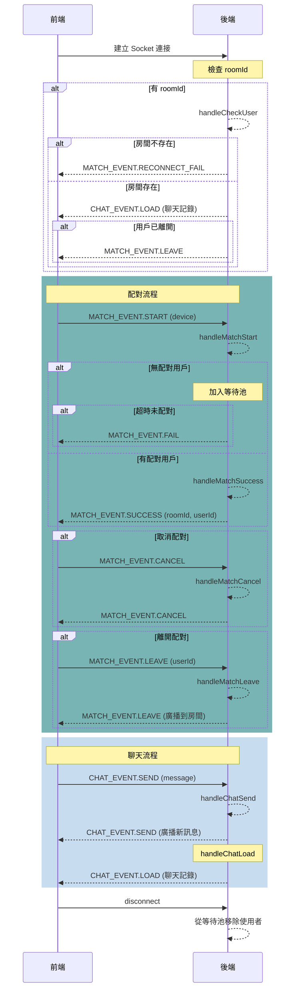

目前已經順利做到 MVP 的程度了，今天就來點輕鬆回（ㄐㄧㄢˇ）顧（ㄊㄠˇ）吧！

## 邊做邊改是正常的嗎

正式開發時一定會發現原本的規劃有地方需要做調整，例如事件類型、資料型別、命名等等，就持續在做微調，鐵人賽的版本也是我一邊試錯一邊重構出來的。

雖然整體架構與可讀性也許說不上很好，不過還在我自己能接受的範圍（~~自己講~~）～

我認為開發中最重要的還是「一致性」，如果後面我們發現了更好的寫法，但必須要推翻前面的原則，那麼就必須評估重構的時機，是需要一口氣翻到好，還是一點一點迭代？

個人開發的話想幹嘛就幹嘛，團隊開發一定要坐下來好好討論，歸納出影響範圍、進程、工時等開發指標。隨著工作資歷增加，我也慢慢體認到，開發只是軟體工程的其中一環，前面提到的規劃、歸納、評估等等，也是重要的工程素養！

---

## 適時加入圖表輔助

以往我都是從前端開始開發，並模擬好大部分的邏輯和接入點，但這次是以後端先行的方式開發大部分的業務邏輯，在串接到前端，流程幾乎是依樣畫葫蘆，只要處理事件對應到的 UI 狀態轉移。

但實際撰寫時還是遇到了一些小麻煩 XD

雖然沒有設計太多事件，但等到發生 bug 的時候才會發現有些事件沒有被正確地監聽到！UI 狀態也因應實作需要，邊寫邊增加了幾個過渡狀態。

其實前面做過的事件表、資料表等，在開發前就可以重新整理成前後端方便對照的格式。流程圖也可以從一開始畫的**功能概述版本**再細化成 **詳細分析版本**，明確指示出狀態轉移、資料操作的內容。

小專案不一定會做到這麼細緻，但我目前的感想是：如果需要頻繁地狀態轉移，又和事件有連動的話，在更大型的系統裡面，沒有這些圖表，相信不論前後端，做起來都會相當頭痛 XD

最後我也用 AI 生成了 Mermaid 語法圖表，重新梳理目前實作出來的事件流程，與規劃的方向有沒有符合。發現問題的話也可以在此階段統整出待調整的項目：

---

## 後續開發方向

在補完全部的功能之前，有一件非常重要的事要做：寫測試。

由於我並沒有學過怎麼寫測試，所以開發的時候並沒有以「容易測試」的前提來撰寫，不過這是很重要的觀念。有些語言會設計貼心（？）的隱式行為，有時會造成輸出格式不是我們預期的，這時候如果有測試也會安心很多！

寫測試也會帶來以下好處：

1. 讓程式重構的方向更明確
2. 思考更完善的功能流程與情境
3. 提升開發信心，如果不幸改 A 壞 B 也有助於更快追蹤

先前開發時，架構雖然單純，但是我盡力做到最基本的職責分離，應該沒有哪個功能是流程很簡單但邏輯一大包的慘狀，所以測試應該不會太難寫......吧？

不信嗎？問問看 AI：

（~~史詩級吹捧~~）

接下來的開發內容，就是 80/20 法則中我完全未知的 20% 領域了！
